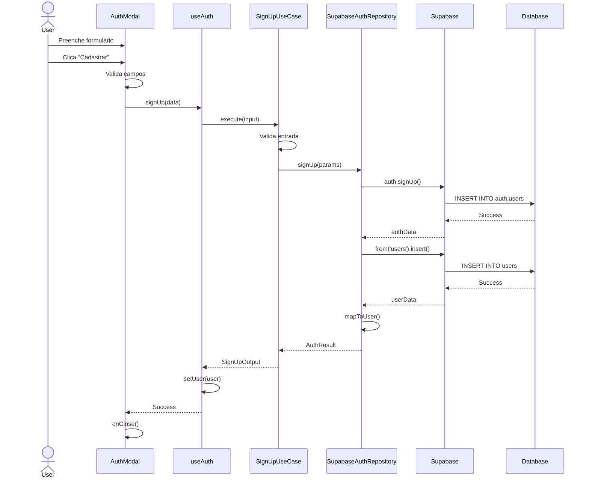
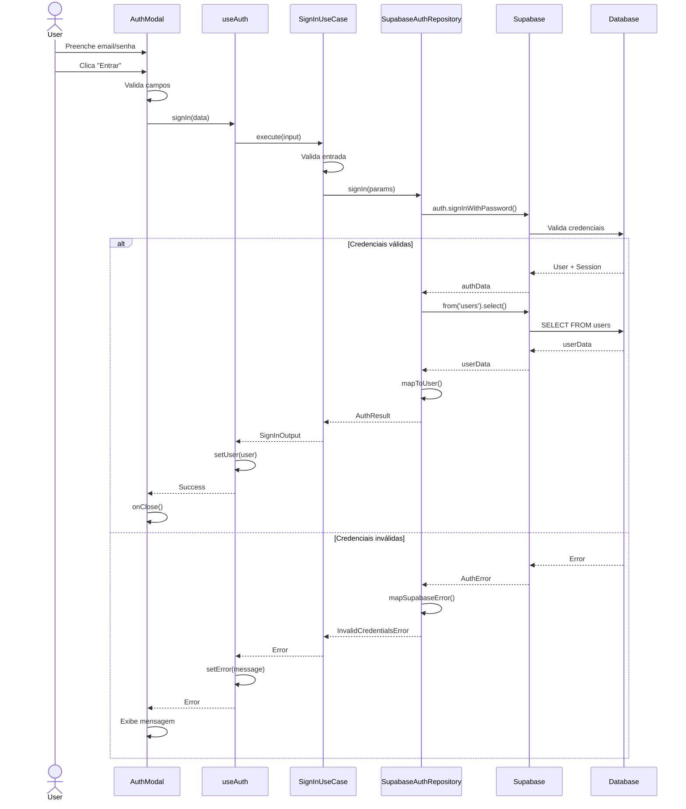
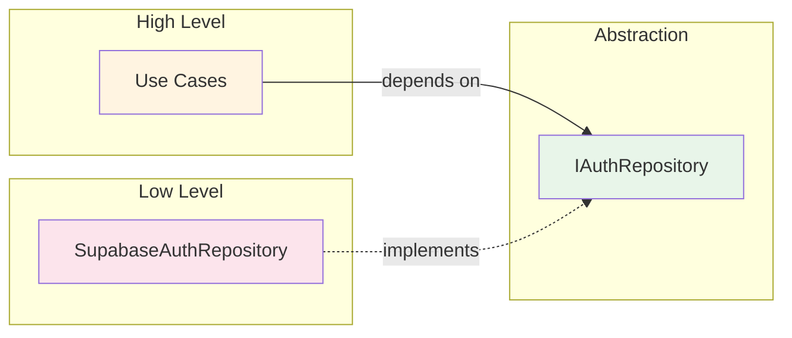
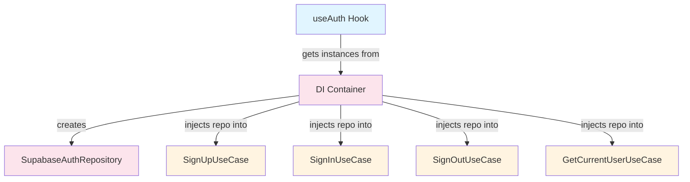
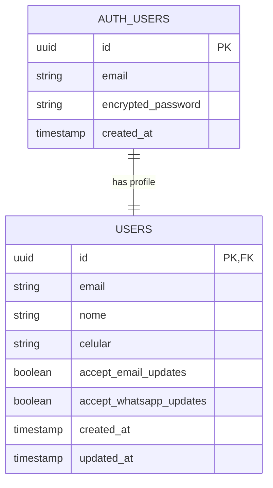
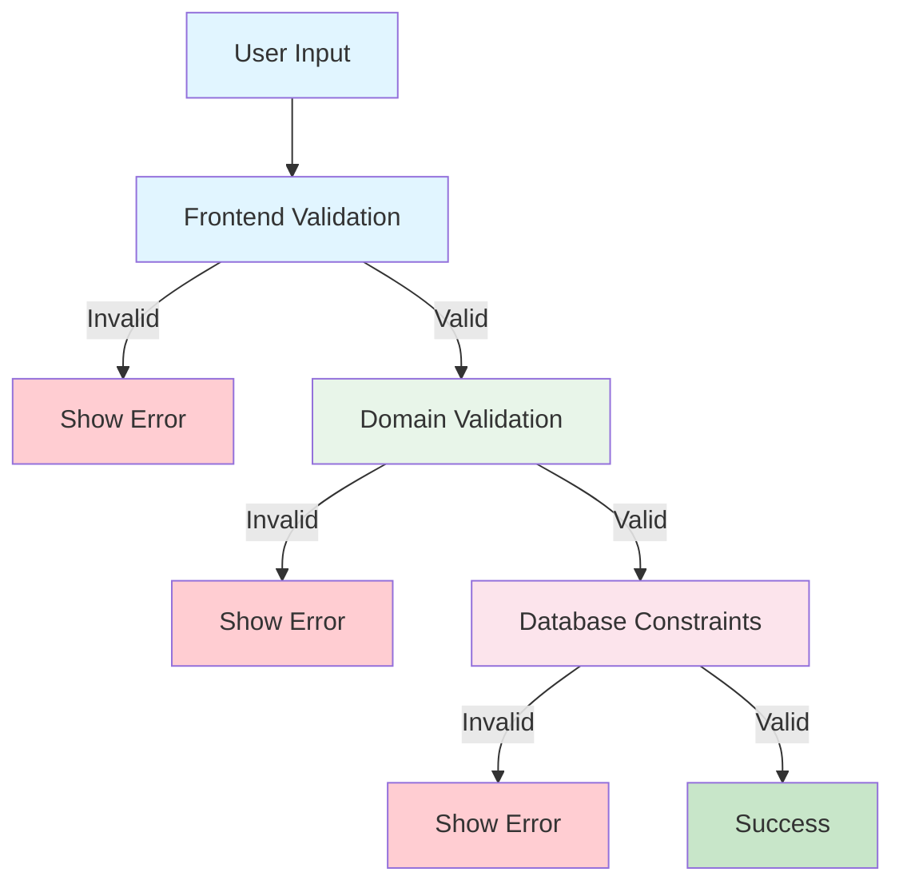
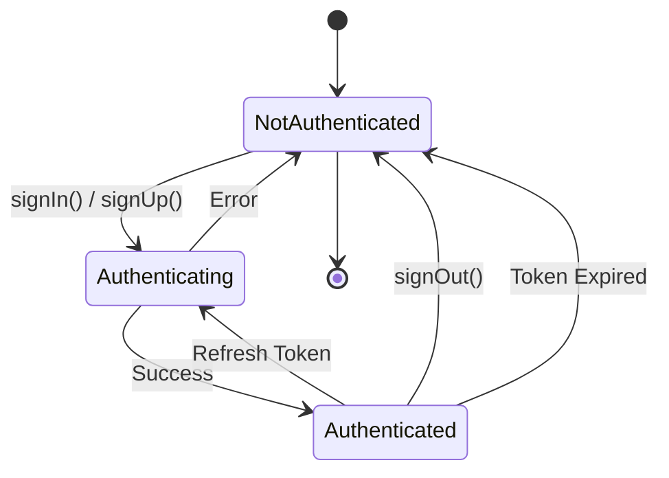

# 🏗️ Diagramas de Arquitetura - Sistema de Autenticação

## 📐 Arquitetura em Camadas

```mermaid
graph TB
    subgraph "PRESENTATION LAYER"
        AuthModal[AuthModal.tsx]
        useAuth[useAuth Hook]
    end

    subgraph "APPLICATION LAYER"
        SignUp[SignUpUseCase]
        SignIn[SignInUseCase]
        SignOut[SignOutUseCase]
        GetUser[GetCurrentUserUseCase]
    end

    subgraph "DOMAIN LAYER"
        User[User Entity]
        Errors[Auth Errors]
        IRepo[IAuthRepository Interface]
    end

    subgraph "INFRASTRUCTURE LAYER"
        SupaRepo[SupabaseAuthRepository]
        SupaClient[Supabase Client]
        DI[DI Container]
    end

    AuthModal --> useAuth
    useAuth --> SignUp
    useAuth --> SignIn
    useAuth --> SignOut
    useAuth --> GetUser

    SignUp --> IRepo
    SignIn --> IRepo
    SignOut --> IRepo
    GetUser --> IRepo

    SignUp --> User
    SignIn --> User
    GetUser --> User

    SignUp -.uses.-> Errors
    SignIn -.uses.-> Errors

    IRepo <|.. SupaRepo
    SupaRepo --> SupaClient
    SupaRepo --> User
    SupaRepo --> Errors

    DI --> SignUp
    DI --> SignIn
    DI --> SignOut
    DI --> GetUser
    DI --> SupaRepo

    style AuthModal fill:#e1f5ff
    style useAuth fill:#e1f5ff
    style SignUp fill:#fff4e1
    style SignIn fill:#fff4e1
    style SignOut fill:#fff4e1
    style GetUser fill:#fff4e1
    style User fill:#e8f5e9
    style Errors fill:#e8f5e9
    style IRepo fill:#e8f5e9
    style SupaRepo fill:#fce4ec
    style SupaClient fill:#fce4ec
    style DI fill:#fce4ec
```

## 🔄 Fluxo de Cadastro (SignUp)



## 🔐 Fluxo de Login (SignIn)



## 🎯 Princípio de Dependência (DIP)



**Regra**: Use Cases (alto nível) dependem de abstração (interface), não de implementação (Supabase).

## 🧩 Dependency Injection



## 🔒 Row Level Security (RLS)

```mermaid
graph TB
    User[User Request]
    Supa[Supabase]
    RLS[RLS Engine]
    DB[(Database)]

    User -->|SELECT * FROM users| Supa
    Supa -->|Check JWT| RLS

    RLS -->|Policy Check| Policy{Policy: auth.uid() = id?}

    Policy -->|Yes| Allow[Return user's data]
    Policy -->|No| Deny[Return empty]

    Allow --> DB
    Deny -.x.-> DB

    DB --> User

    style User fill:#e1f5ff
    style Supa fill:#fce4ec
    style RLS fill:#fff4e1
    style Policy fill:#e8f5e9
    style Allow fill:#c8e6c9
    style Deny fill:#ffcdd2
```

## 📊 Estrutura de Dados



## 🎨 Fluxo de Validação



**3 Camadas de Validação:**

1. **Frontend**: UX imediata
2. **Domain**: Regras de negócio
3. **Database**: Integridade final

## 🔄 Estado da Aplicação



---

## 📖 Legenda

| Cor        | Camada               |
| ---------- | -------------------- |
| 🔵 Azul    | Presentation Layer   |
| 🟡 Amarelo | Application Layer    |
| 🟢 Verde   | Domain Layer         |
| 🔴 Rosa    | Infrastructure Layer |

---

Estes diagramas ajudam a visualizar:

-   ✅ Fluxo de dados entre camadas
-   ✅ Separação de responsabilidades
-   ✅ Princípios SOLID aplicados
-   ✅ Segurança RLS
-   ✅ Padrões de design

**Use estes diagramas para:**

-   Entender a arquitetura
-   Explicar para a equipe
-   Documentar decisões
-   Planejar extensões
